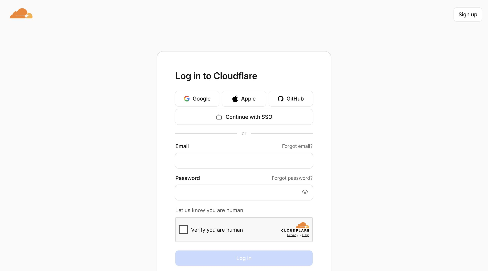
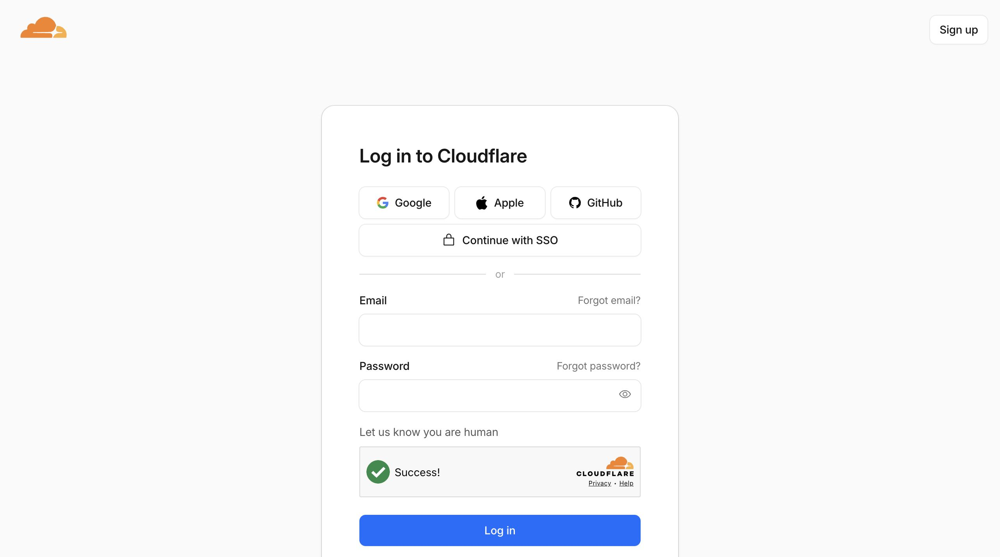
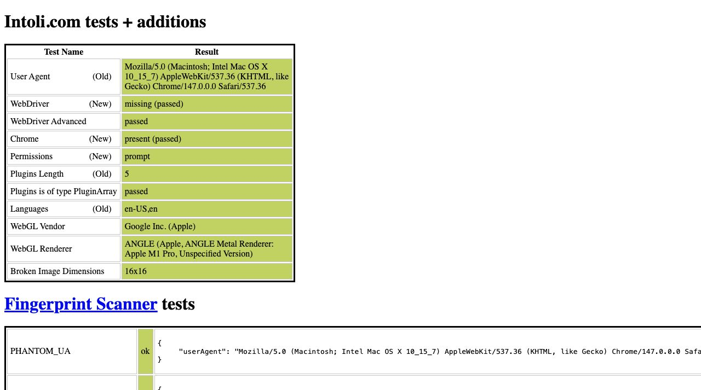

# Visual Demo — Proven Real-World Bypasses

All screenshots below are captured from live test runs of `mcp-stealth-chrome`.
Reproduce any of these by following the workflow steps.

---

## Demo 1: Cloudflare Turnstile Bypass (`click_turnstile()`)

**Target**: `https://dash.cloudflare.com/login` — Cloudflare's own dashboard login with Turnstile managed mode.

### Before: Checkbox disabled, Login button grey



Page state:
- Checkbox ☐ "Verify you are human"
- Login button DISABLED (greyed out)
- Turnstile widget rendered inline (no iframe)

### Workflow (3 tool calls, ~8 seconds)

```
browser_launch(url="https://dash.cloudflare.com/login", headless=false)
mouse_drift(duration_seconds=2)               # natural behavior
click_turnstile()                             # ⭐ one-liner bypass
```

### After: Success! + Login button enabled



Page state:
- Checkbox ✅ GREEN CHECKMARK "Success!"
- Login button ENABLED (blue)
- Turnstile token injected into `input[name="cf_challenge_response"]`

**This is proof that nodriver + correct click position bypasses CF Turnstile without CapSolver.**

---

## Demo 2: Bot Detection Fingerprint Tests (`bot.sannysoft.com`)

Industry-standard bot detection test. nodriver's stealth passes all checks.

### All tests pass



Test results:
- ✅ **WebDriver (New)**: `missing (passed)` — no `navigator.webdriver` leak
- ✅ **WebDriver Advanced**: passed
- ✅ **Chrome (New)**: `present (passed)` — browser identifies as real Chrome
- ✅ **Plugins is of type PluginArray**: passed
- ✅ **PHANTOM_UA**: ok — real UA
- ✅ **PHANTOM_PROPERTIES**: ok
- ✅ **PHANTOM_ETSL**: ok — timing normal
- ✅ **PHANTOM_LANGUAGE**: ok
- ✅ **PHANTOM_WEBSOCKET**: ok
- ✅ WebGL vendor: `Google Inc. (Apple)` — real GPU via Apple M1 Pro ANGLE
- ✅ WebGL renderer: `ANGLE (Apple, ANGLE Metal Renderer: Apple M1 Pro...)`

**Compare**: vanilla Playwright fails ~80% of these checks.

---

## Demo 3: TLS Fingerprint Rotation (`http_request`)

**Target**: `https://tls.browserleaks.com/json` — deep TLS/JA3/JA4 inspection.

### Comparison test output

```
[A] Vanilla httpx (Python):
    JA3 hash : 37f7d09ced1a845dc48872abc1a29d7b        ← BOT signature
    JA4      : t13d1712h1_ab0a1bf427ad_8e6e362c5eac
    UA       : python-httpx/0.28.1                      ← dead giveaway

[B] http_request(impersonate='chrome'):
    JA3 hash : f830262a93191fd695c65531282d5657        ← Real Chrome
    JA4      : t13d1516h2_8daaf6152771_d8a2da3f94cd
    UA       : Mozilla/5.0 (Macintosh...) Chrome/146.0.0.0 Safari/537.36

[C] http_request(impersonate='firefox'):
    JA3 hash : 6f7889b9fb1a62a9577e685c1fcfa919        ← Real Firefox
    JA4      : t13d1717h2_5b57614c22b0_3cbfd9057e0d
    UA       : Mozilla/5.0 (Macintosh...) Firefox/147.0

[D] http_request(impersonate='safari'):
    JA3 hash : ecdf4f49dd59effc439639da29186671        ← Real Safari
    JA4      : t13d2013h2_a09f3c656075_7f0f34a4126d
    UA       : Mozilla/5.0 (Macintosh...) Safari/605.1.15
```

**Proof**: each impersonate profile generates TLS handshake that matches real browser.
Cloudflare/DataDome cannot distinguish our HTTP requests from genuine browsers.

**Extra evidence**: response `content-encoding: zstd` — only modern Chrome supports zstd compression, confirming deep impersonation (not just UA header swap).

---

## Demo 4: Multi-Instance Parallel Browsers (`spawn_browser`)

Run two independent browsers with separate profiles simultaneously.

### Workflow

```
browser_launch(url="https://example.com")         # main instance
spawn_browser("scraper_2", url="https://httpbin.org/")
```

### `list_instances` output

```json
[
  {
    "instance_id": "scraper_2",
    "current": false,
    "running": true,
    "tabs": 1,
    "idle_seconds": 4,
    "idle_timeout": 600,
    "auto_close_in": 596,
    "profile": "/Users/macbook/.mcp-stealth/profiles/scraper_2",
    "uptime_seconds": 4
  },
  {
    "instance_id": "main",
    "current": true,
    "running": true,
    "tabs": 1,
    "idle_seconds": 20,
    "idle_timeout": 600,
    "auto_close_in": 580,
    "profile": null,
    "uptime_seconds": 20
  }
]
```

### Switch and verify isolation

```
switch_instance("scraper_2")
get_url()                    → "https://httpbin.org/"
switch_instance("main")
get_url()                    → "https://example.com/"     # state preserved
```

**Proof**: State (URL, cookies, tabs) persists independently per instance. Switching is instant.

---

## Demo 5: Anti-Bot Auto-Detection (`detect_anti_bot`)

### Output on Cloudflare login

```json
{
  "detected": ["Cloudflare"],
  "recommended_tools": [
    "click_turnstile() or verify_cf() for challenges",
    "http_request(impersonate='chrome') for API calls"
  ],
  "cookies_found": ["_ga", "cf_v", "OptanonConsent", ...]
}
```

Automatically identifies protection system and suggests the right toolkit.

Supported signatures:
- Cloudflare (`__cf_bm`, `cf_clearance`, `challenges.cloudflare.com`)
- DataDome (`datadome`, `dd_s`)
- PerimeterX/HUMAN (`_pxAppId`, `_pxCID`, `_pxhd`)
- Akamai Bot Manager (`_abck`, `bm_sz`)
- Kasada (`KPSDK`)
- Imperva/Incapsula (`incap_ses`, `visid_incap`)
- reCAPTCHA (`window.grecaptcha`)
- hCaptcha (`window.hcaptcha`)

---

## Reproducing These Demos

1. Install mcp-stealth-chrome (see [INSTALL.md](../INSTALL.md))
2. In Claude/Cursor, prompt:
   > "Use stealth-chrome to navigate to `dash.cloudflare.com/login` then call click_turnstile"
3. Screenshot saved to `~/.mcp-stealth/screenshots/`

All demos above are runnable without any API keys. CapSolver / Anthropic keys only
needed for premium CAPTCHA solvers.
